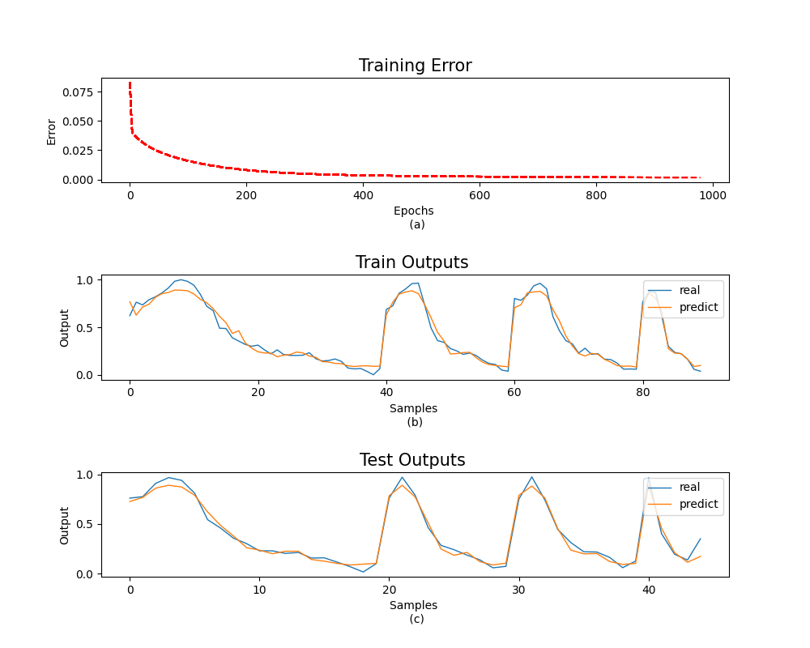
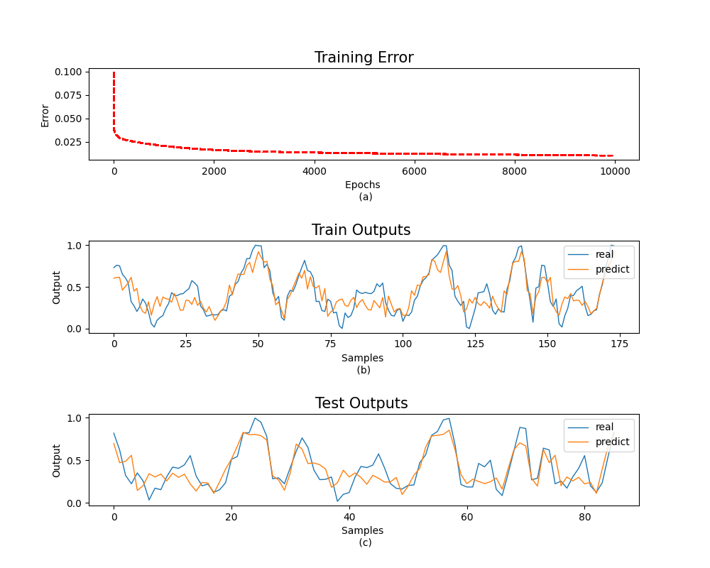
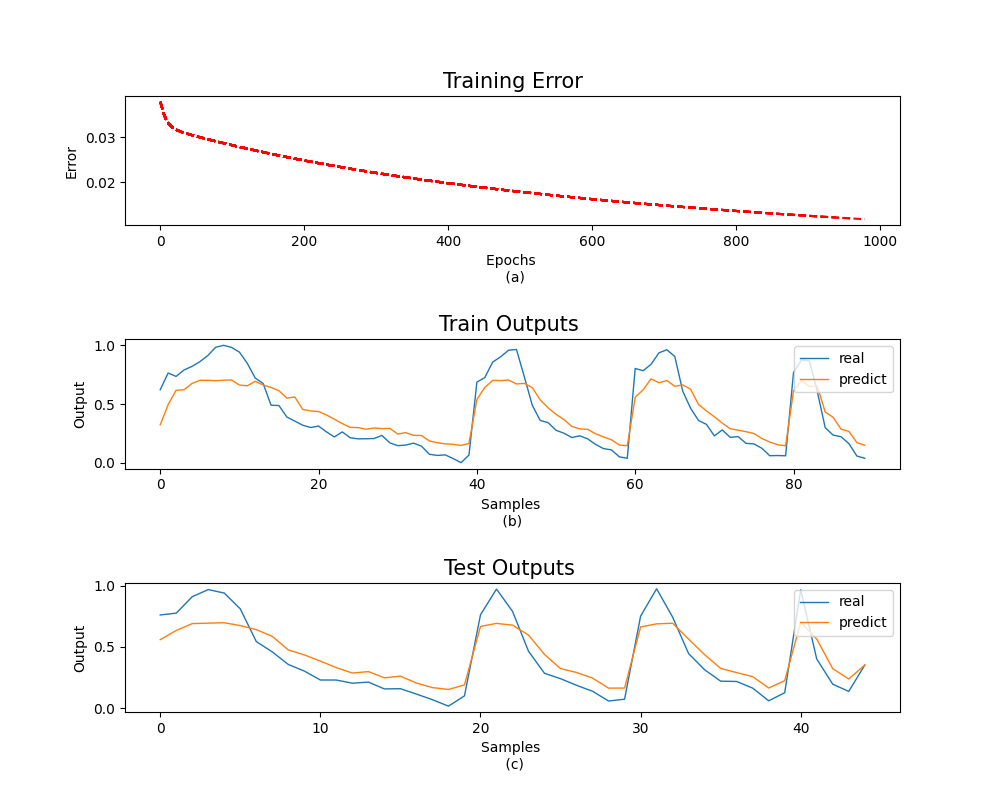
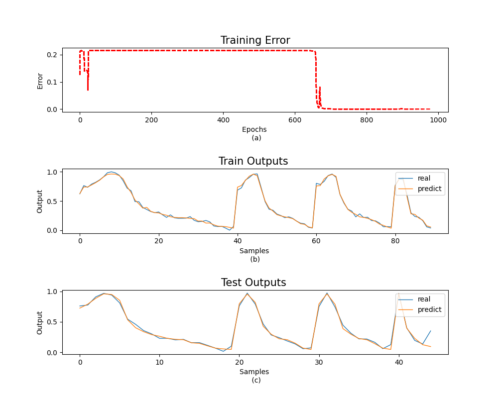

# 实验二 BP 神经网络

## 一 公式推导

### 1. Sigmoid 函数的导数

Sigmoid 函数：
$$
\sigma(x) = \frac{1}{1+e^{-x}}
$$
Sigmoid 函数的导数为：
$$
\frac{d}{dx}\sigma(x) = \frac{d}{dx} \left(\frac{1}{1+e^{-x}} \right) \\
= \sigma(1-\sigma)
$$

### 2. 均方差函数梯度

均方差损失函数表达式为：
$$
L = \frac{1}{2}\sum_{k=1}^{K}(y_k-o_k)^2
$$
其中$y_k$为真实值，$o_k$为输出值。则它的偏导数$\frac{\partial L}{\partial o_i}$可以展开为：
$$
\frac{\partial L}{\partial o_i} = \frac{1}{2}\sum_{k=1}^{K}\frac{\partial}{\partial o_i}(y_k - o_k)^2
$$
均方差的导数可以推导为:
$$
\frac{\partial L}{\partial o_i} = (o_i - y_i)
$$

### 3. 反向传播算法

- 输出层
  $$
  \frac{\partial L}{\partial w_{jk}} = \delta _k^K\cdot o_j \\
  \delta _k^K = (o_k-t_k)o_k(1-o_k)
  $$
  输出层节点数为 `K` ，输出$o^k = [o_1^k, o_2^k, o_3^k,..., o_k^k]$.

- 隐藏层

  $$
  \frac{\partial L}{\partial w_{ij}} = \delta _j^J\cdot o_i \\
  \delta_j^J = o_j(1-o_j) \cdot \sum_k \delta _k^K\cdot w_{jk}
  $$
   隐藏层的节点数为 `J` ，输出为 $o^J=[o_1^J, o_2^J,..., o_J^J]$, $o_i$为输入变量.

## 二 算法步骤

1. 初始化权值及阈值为小的随机数;

2. 给出输入$x_0，x_1…x_{n-1}$及期望输出 $t_0，t_1…t_{n-1}$;

3. 正向传播, 逐层计算输出;

4. 反向传播, 修正权值.

5. 重复（3）~（5），直到对所有样本权值不变.

<div STYLE="page-break-after: always;"></div>

## 三 实验结果与分析

### 1. 实验结果:

- 数据集 HDPE_15:



<center>图1. 训练集1, 31个隐藏层节点, 训练1000代, 学习率0.6</center>

<div STYLE="page-break-after: always;"></div>

- 数据集 PTA_17:



<center>图2. 训练集2, 37个隐藏层节点, 训练10000代， 学习率0.6</center>

<div STYLE="page-break-after: always;"></div>

其它实验:



<center>图3. 训练集1, 31个隐藏层节点, 训练1000代, 学习率0.06</center>



<center>图4. 训练集1, 31个隐藏层节点, 训练1000代, 学习率60</center>

### 2. 结果分析

本次实验之中, 此神经网络是一个三层全连接神经网络, 包含一个输入层、一个隐藏层和一个输出层. 若输入层有$n$ 个节点, 隐藏层的节点数量为$2n+1$个. 由于$Sigmoid$ 函数具有非线性,光滑可导等优良特性, 此神经网络使用$Sigmoid$作为激活函数，并在训练时使用反向传播算法来更新权重和偏置.

在训练和测试之前，由于原始数据具有量纲, 数值差距大. 如果直接进行数值计算会损失计算结果精度和收敛速率. 所以数据需要经过归一化处理。

在迭代过程中，函数形状类似反比例函数且训练误差不断减小，减小速度不断降低。改变学习速率和动量因子会影响网络的收敛速度和稳定性. 对比图1,3,4 可发现适中的学习率可有效提高训练收敛的速度, 过大的学习率会导致模型在梯度方向上来回震荡，甚至可能导致模型无法收敛.
<div STYLE="page-break-after: always;"></div>
## 附录: 代码

```python
import numpy as np
import pandas as pd
import matplotlib.pyplot as plt
from sklearn import preprocessing


def fun_s(x):
    return 1.0 / (1.0 + np.exp(-x))


df1 = pd.read_excel('C:/Users/HP/Downloads/Bp神经网络/Bp神经网络/1.xlsx', 0)
df1 = df1.iloc[:, :]
# 进行数据归一化
min_max_scaler = preprocessing.MinMaxScaler()
df0 = min_max_scaler.fit_transform(df1)  # 将训练与测试集数据归一化
df = pd.DataFrame(df0, columns=df1.columns)
x = df.iloc[:, :-1]
y = df.iloc[:, -1]

Inum = x.shape[1]
Hnum = 30
Onum = 1

m, n = x.shape

# 划分训练集测试集
cut = 45  # 取最后60行为测试集
m = m-cut
# 列表的切片操作，X.iloc[0:2400，0:7]即为1-2400行，1-7列
x_t, x_gen = x.iloc[:-cut], x.iloc[-cut:]
d_t, d_gen = y.iloc[:-cut], y.iloc[-cut:]

x_t, d_t = x_t.values, d_t.values.reshape(-1, 1)
x_gen, d_gen = x_gen.values, d_gen.values.reshape(-1, 1)


# Initialize weights
Wih = 2 * np.random.rand(Inum, Hnum)-1
Who = 2 * np.random.rand(Hnum, Onum)-1
# Wih = np.ones((Inum, Hnum))
# Who = np.ones((Hnum, Onum))
dw_wih = np.zeros((Inum, Hnum))
dw_who = np.zeros((Hnum, Onum))

# Train network
E_max = 1e-4
Train_num = 1000
eta = 0.6
aerf = 0.4
E = []
plt.subplots(nrows=3, ncols=1, figsize=(10, 8))
plt.subplots_adjust(hspace=0.886)

for i in range(Train_num):
    Hin = np.dot(x_t, Wih)
    Hout = fun_s(Hin)
    Opin = np.dot(Hout, Who)
    Opot = fun_s(Opin)
    E_p = (d_t - Opot)
    E_train = np.sum(0.5 * E_p ** 2) / m
    E.append(E_train)

    if i % 20 == 0:
        plt.subplot(3, 1, 1)
        plt.title("Training Error", fontsize='15')  # 添加标题
        plt.xlabel("Epochs \n (a)")
        plt.ylabel("Error")
        plt.plot(E[:i], 'r--')
        plt.pause(0.001)
        plt.draw()

    if E_train < E_max:
        flag = 1
        break

    detea_ho = Opot * (1 - Opot) * E_p
    
    dw_ho = np.zeros((Hnum, m))
    for j in range(m):
        tmp_Hout = Hout[[j]].T
        dw_ho[:, j, np.newaxis] = eta * detea_ho[j] * tmp_Hout
    dw_who = np.mean(dw_ho, axis=1, keepdims=True) + aerf * dw_who

    detea_ih = np.zeros((m, Hnum))
    for j in range(m):
        detea_ih[j] = Hout[j, :] * (1 - Hout[j, :]) * (detea_ho[j] * Who.T)
        
    dw_ih = np.zeros((Inum, Hnum, m))
    for j in range(m):
        for k in range(Hnum):
            tmp_x_t = x_t[[j]].T
            dw_ih[:, k, j, np.newaxis] = eta * detea_ih[j, k] * tmp_x_t
    dw_wih = np.mean(dw_ih, axis=2) + aerf * dw_wih
    Wih = Wih + dw_wih  # 更新权重
    Who = Who + dw_who
Hin_train = np.dot(x_t, Wih)
Hout_train = fun_s(Hin_train)
Opin_train = np.dot(Hout_train, Who)
Opot_train = fun_s(Opin_train)

# plt.figure()
# E_r = abs(d_t - Opot_train)
# plt.plot(E_r, linewidth=1, linestyle="solid")

# # plt.legend(('real', 'predict'),loc='upper right',fontsize='15')
# plt.title("Training Error",fontsize='20') #添加标题


plt.subplot(3, 1, 2)
plt.plot(d_t, linewidth=1, linestyle="solid")
plt.plot(Opot_train, linewidth=1, linestyle="solid")
plt.ylabel("Output")
plt.xlabel("Samples \n (b) ")
plt.legend(('real', 'predict'), loc='upper right', fontsize='10')
plt.title("Train Outputs ", fontsize='15')  # 添加标题


Hin_train = np.dot(x_gen, Wih)
Hout_train = fun_s(Hin_train)
Opin_train = np.dot(Hout_train, Who)
Opot_train = fun_s(Opin_train)

plt.subplot(3, 1, 3)
plt.plot(d_gen, linewidth=1, linestyle="solid")
plt.plot(Opot_train, linewidth=1, linestyle="solid")
plt.ylabel("Output")
plt.xlabel("Samples \n (c)")
plt.legend(('real', 'predict'), loc='upper right', fontsize='10')
plt.title("Test Outputs ", fontsize='15')  # 添加标题
plt.show()

```

