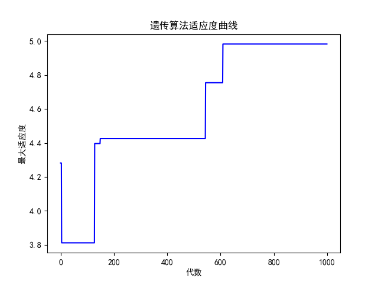
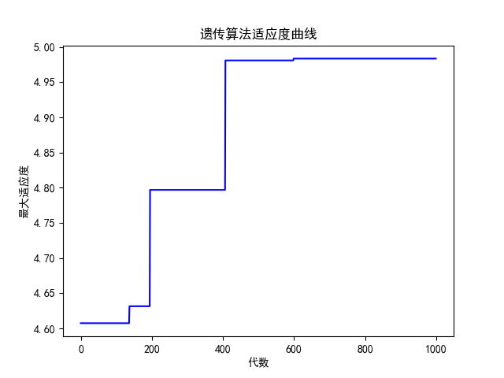
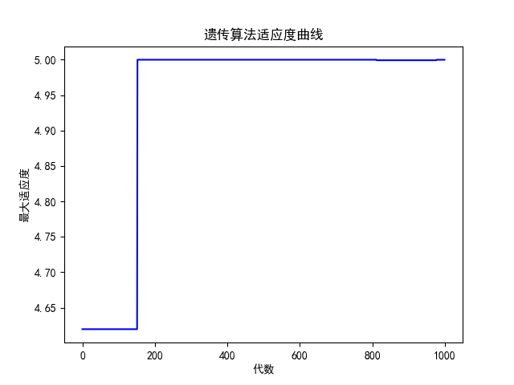
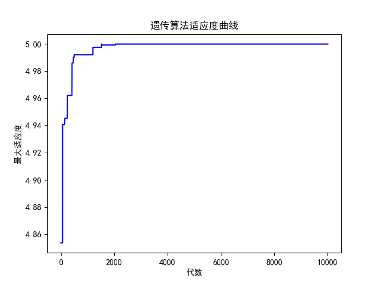

# 实验一 基于遗传算法的函数优化

## 一 实验目标

设 $f(x) = -x^2 - 4x + 1$, 求 $\max f(x)$, $x \in [-2, 2]$, 解的精度保留二位小数.

## 二 遗传算法主旨思想

### 1. 编码和产生初始群体

保留$n$位小数时, 设数在区间$[x,y]$ 之间则二进制串的最小位数$j$ 需要满足如下关系式:
$$
2^{j-1} < \frac{y-x}{10^n}<2^{j}
$$
在此问题中$j=9$

在实际编程中无需先产生十进制的随机数再通过编码的方式转换为二进制串,而是直接随机生成指定位数的二进制串, 在需要用到数的真值时进行解码, 通过以下公式
$$
b_{j-1}b_{j-2}…b_{1}b_{0}\Leftrightarrow x' = \sum_{i = 0}^j b_i \cdot 2^i \Leftrightarrow x = a + x' \cdot \frac{y-x}{2^j-1}
$$

### 2. 定义适应函数和适应值

$$
g(x) = f(x) - F_{min}
$$

此处取$F_{min}$ 为当前种群$f(x)$ 的最小值即可保证适应度函数大于0, $f(x)$越大适应度最高.

### 3. 更新种群 

#### 确定选择标准

用适应值比例来作为入选概率, 适应度越高入选概率越大. 

设给定的规模为$n$ 的群体$pop={a_1,a_2, ..., a_n}$,个体 $a_i$的适应值为则其入选概率为$g(a_i)$
$$
P_s(a_i) = \frac{g(a)}{\sum_{i=1}^{n}g(a_i)}(i=1,2,3,...,n)
$$


#### 交叉与变异

- 交叉也就是将一组染色体上对应基因段的交换得到新的染色体,然后得到新的染色体组,组成新的群体. 其有以下三个作用:
  - 帮助避免早熟收敛, 早熟收敛是指遗传算法在搜索空间中找到一个局部最优解而不是全局最优解的现象.通过交叉操作,遗传算法可以产生更多的多样性和新的组合,从而避免早熟收敛,并增加算法找到全局最优解的可能性.
  - 提高遗传算法的搜索能力: 交叉操作可以产生更多的多样性和新的组合,这些新的个体可以探索搜索空间中的新区域.通过交叉操作,遗传算法可以在搜索空间中更加全面地搜索,从而提高搜索能力.
  - 促进遗传算法的收敛速度: 交叉操作可以将优秀的基因组合在一起,并且丢弃不良的基因.这种操作可以快速地产生优秀的后代个体,并且提高后代个体的质量.这可以促进遗传算法的收敛速度,并加速找到最优解的过程.
- 变异就是通过一个小概率改变染色体位串上的某个基因. 其有以下四个作用:
  - 多样性维持: 变异操作可以在染色体的某个位置随机地改变基因值,从而产生新的个体,增加种群的多样性,避免陷入局部最优解.
  - 搜索空间扩展: 通过变异操作可以增加搜索空间,从而提高全局搜索性能.
  - 收敛速度控制: 变异概率不能太高,否则会导致算法的局部搜索性能降低,收敛速度变慢.一般来说,变异概率通常设置在0.001~0.01之间.
  - 算法鲁棒性提高: 在某些情况下,变异操作可以通过随机性的引入,增强算法的鲁棒性,使得算法更加适用于复杂的优化问题.


## 三 实验结果与分析

### 1. 实验结果

```cmd
输出结果为:
DNA_SIZE: 9
最优的基因型:  [0 0 0 0 0 0 0 1 0]
x: -1.984344422700587
y: 4.999754902899422
```



<center>图1. 染色体交换概率: 0.6	变异概率0.01	选择方式: 轮盘赌&不保留精英</center>



<center>图2. 染色体交换概率: 0.6	变异概率0.01	选择方式: 轮盘赌&保留精英</center>



<center>图3. 染色体交换概率: 0.6	变异概率0.5	选择方式: 轮盘赌&不保留精英</center>



<center>图4. 染色体交换概率: 0.01	变异概率0.01	选择方式: 轮盘赌&不保留精英</center>

### 2. 结果分析

- 搜索具有随机性, 每次搜索的过程与搜索结果不相同, 但会收敛到最优解附近.
- 由于通过编码的方式对最优值进行求解会损失一定最优性. 例如, 该函数在$x=-2$时取到最大值, 但在算法中得到$x=-1.984$.
- 加入保留精英策略(对比图1, 图2)会有以下优缺点: 
  - 优点 :
    1. 保留优秀个体: 精英策略可以保留上一代中的最优解,避免遗传算法的优良特性在进化过程中被稀释或丢失. 得到的结果会呈现持续优化的效果或者效果保持不变, 不会出现最优解变差的情况; 
    2. 快速收敛: 由于精英策略的存在,可以加速算法的收敛速度; 
    3. 算法鲁棒性: 精英策略可以提高算法的鲁棒性,降低算法陷入局部最优解的概率.
  - 缺点:
    1. 容易陷入局部最优: 如果精英策略过于强调保留历史最优解,有可能导致算法收敛到局部最优解而无法到达全局最优解; 
    2. 缺乏多样性: 精英策略可能导致算法过度关注历史最优解,使种群缺乏多样性.

- 适当的变异概率会提高收敛速率(对比图1，图3), 但是变异概率不能太高,否则会导致算法的局部搜索性能降低,收敛速度变慢.变异概率通常设置在0.001~0.01之间.

- 适当的染色体交叉概率会提高收敛效率(对比图1, 图4), 过低的染色体交叉率导致图中经过2000代仍未收敛.

## 附录: 代码

```python
import numpy as np
import matplotlib.pyplot as plt
from pylab import mpl
# 设置显示中文字体
mpl.rcParams["font.sans-serif"] = ["SimHei"]
# 设置正常显示符号
mpl.rcParams["axes.unicode_minus"] = False


DNA_SIZE = 9
POP_SIZE = 10
CROSSOVER_RATE = 0.6
MUTATION_RATE = 0.01
N_GENERATIONS = 1000
X_BOUND = [-2,2]
X_V = []
for j in range(30):
    bit = (X_BOUND[1] - X_BOUND[0])/1e-2
    if (2**j < bit and 2**(j+1) > bit):
        DNA_SIZE = j+1
        break
print("DNA_SIZE:",DNA_SIZE)
        

def F(x):
    return -x**2 - 4*x + 1  

def get_fitness(pop):
    x = translateDNA(pop)
    pred = F(x)
    # return pred
    return pred - np.min(pred)+1e-3  # 求最大值时的适应度
    # fitness = np.max(pred) - pred + 1e-6 
    # 求最小值时的适应度，通过这一步fitness的范围为[0, np.max(pred)-np.min(pred)]
    # return fitness

# pop表示种群矩阵，一行表示一个二进制编码表示的DNA，矩阵的行数为种群数目
def translateDNA(pop):  
    x_pop = pop.copy()  
    x = x_pop.dot(2 ** np.arange(DNA_SIZE)[::-1]) / float(2 ** DNA_SIZE - 1) * (X_BOUND[1] - X_BOUND[0]) + X_BOUND[0]
    return x


def crossover_and_mutation(pop, CROSSOVER_RATE=0.8):
    new_pop = []
    fitness = get_fitness(pop)
    max_fitness_index = np.argmax(fitness)
    for father in pop:  # 遍历种群中的每一个个体，将该个体作为父亲
        child = father  # 孩子先得到父亲的全部基因
        if np.random.rand() < CROSSOVER_RATE:  # 产生子代时不是必然发生交叉，而是以一定的概率发生交叉
            mother = pop[np.random.randint(POP_SIZE)]  # 再种群中选择另一个个体，并将该个体作为母亲
            cross_points = np.random.randint(low=0, high=DNA_SIZE * 2)  # 随机产生交叉的点
            child[cross_points:] = mother[cross_points:]  # 孩子得到位于交叉点后的母亲的基因
        mutation(child)  # 每个后代有一定的机率发生变异
        new_pop.append(child)
    new_pop[0] = pop[max_fitness_index] # 保留精英

    return new_pop


def mutation(child, MUTATION_RATE=0.003):
    if np.random.rand() < MUTATION_RATE:  # 以MUTATION_RATE的概率进行变异
        mutate_point = np.random.randint(0, DNA_SIZE)  # 随机产生一个实数，代表要变异基因的位置
        child[mutate_point] = child[mutate_point] ^ 1  # 将变异点的二进制位反转


def select(pop, fitness):  # nature selection wrt pop's fitness
    idx = np.random.choice(np.arange(POP_SIZE), size=POP_SIZE, replace=True,
                           p=(fitness) / (fitness.sum()))
    return pop[idx]


def print_info(pop):
    fitness = get_fitness(pop)
    max_fitness_index = np.argmax(fitness)
    print("max_fitness:", fitness[max_fitness_index])
    x = translateDNA(pop)
    print("最优的基因型：", pop[max_fitness_index])
    print("x:",x[max_fitness_index])
    print(F(x[max_fitness_index]))


if __name__ == "__main__":
    plt.figure()
    pop = np.random.randint(2, size=(POP_SIZE, DNA_SIZE))  # matrix (POP_SIZE, DNA_SIZE)
    
    for i in range(N_GENERATIONS):  # 迭代N代
        x = translateDNA(pop)
        pop = np.array(crossover_and_mutation(pop, CROSSOVER_RATE))
        fitness = get_fitness(pop)
        max_fitness_index = np.argmax(fitness)
        x = translateDNA(pop)
        X_V.append(F(x[max_fitness_index]))
        pop = select(pop, fitness)  # 选择生成新的种群
    # X_V
    print_info(pop)
    plt.plot(list(range(0,N_GENERATIONS)),X_V,color='b')
    plt.xlabel('代数')
    plt.ylabel('最大适应度')
    plt.title('遗传算法适应度曲线')
    plt.show()
```

